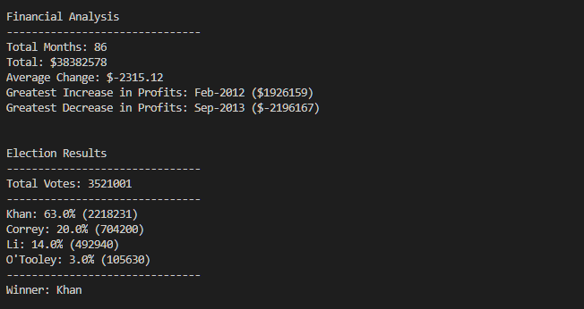

# Prompt
Use basic Python to run analysis on two different datasets. The requirements for each are below.  
- Financial Records
  * The total number of months included in the dataset
  * The net total amount of "Profit/Losses" over the entire period
  * The average of the changes in "Profit/Losses" over the entire period
  * The greatest increase in profits (date and amount) over the entire period
  * The greatest decrease in losses (date and amount) over the entire period   
  
- Election Results
  * The total number of votes cast
  * A complete list of candidates who received votes
  * The percentage of votes each candidate won
  * The total number of votes each candidate won
  * The winner of the election based on popular vote.


# Python Dependencies
- OS
- CSV  

# Process
- **Open and Read CSV**  
Both datasets are in CSV format so the process for reading the data is the same. We specify the CSV we're working with in `open()` and set it to r for read. The data is then stored in the variable "csv_reader". Since there is a header the `next()` is used to exclude it from the list.

- **Financial Analysis**  
To make the data easier to manipulate the CSV is separated into two seperate lists using a `for loop`. One for every month in the dataset and one for the monetary values.  
  * The total number of months can be calculated using the length of the dataset after it is changed to a list.
  ```
  months = len(list(csv_reader))
  ```
  
  * The average change over the entire period of months can be found using the following formula. The first item in the list is being subtracted from the last and then divided by the total number of months.
  ```
  average_change = (pl_values[0] - pl_values[-1]) *-1 /(int(months) - 1)
  ```
  * The greatest increase and decrease in profit from month to month uses a for loop to append the difference between months to a list. To cycle to list wist the dollar amounts we make the index a variable. To get the data to print with the month and calculated value it is converted into a dictionary. The `min()` and `max()` are used to get the required items.  
  * Use F string formatting and `print()` to display the results in the terminal.  
- **Election Results**
  * Using a `for loop` all of the votes are appended to a list. Using the master list with `count()` we store the number of votes for each candidate. They all have discreet last names so that is used as the parament for `count()`.
  * Dividing total number of votes from the previous steps by the total number of votes and multiplying that by 100 gives us the percent of votes each candidate received.  
  * All of the candidates are added to a dictionary. The key being the candidate's name and value being the total number of votes they received.
  * `Max()` with the candidate dictionary will give us the winner. F string and `print()` displays the election results in the terminal.  
  
# Results

